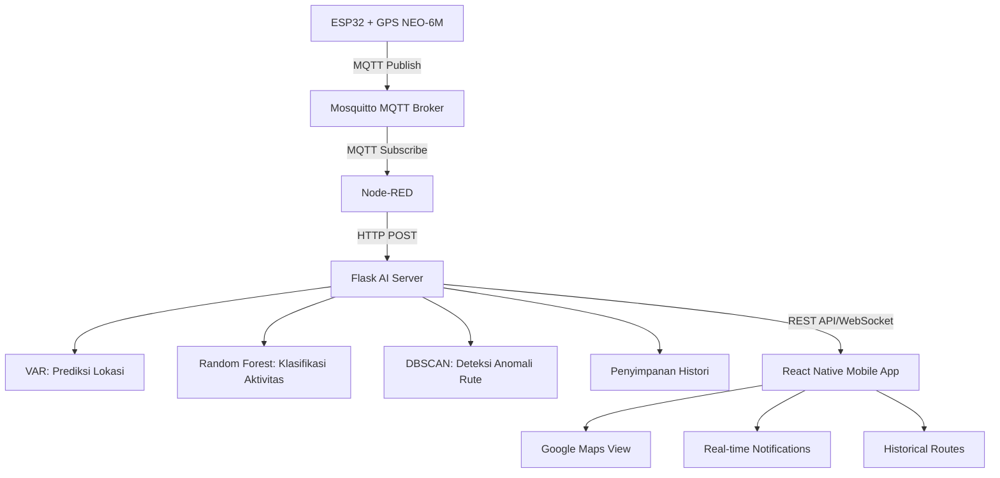

# 🛰️ Smart GPS Tracker with Edge-Based AI

**Smart GPS Tracker with Edge-Based AI for Activity Recognition and Route Anomaly Detection**

<div align="center">


*Sistem pelacakan kendaraan cerdas dengan prediksi lokasi, deteksi aktivitas, dan anomali rute berbasis AI*

**📚 Tugas Akhir Mata Kuliah IoT & AI - Semester 4**

</div>

---

## 🎯 **Tujuan Proyek**

> **📖 Tentang Proyek Ini**  
> Proyek ini merupakan **Tugas Akhir kombinasi** dari mata kuliah **Internet of Things (IoT)** dan **Artificial Intelligence (AI)** pada Semester 4. Proyek ini dirancang untuk mengintegrasikan konsep-konsep yang dipelajari dari kedua mata kuliah tersebut dalam satu implementasi sistem yang komprehensif.

Membangun sistem pelacakan kendaraan berbasis IoT dan mobile yang:

- 📍 **Real-time GPS Tracking** - Pelacakan posisi kendaraan secara real-time *(IoT Component)*
- 🧠 **AI-Powered Predictions** - Prediksi lokasi menggunakan algoritma VAR (Vector Autoregression) *(AI Component)*
- 🏃 **Activity Recognition** - Klasifikasi aktivitas (jalan kaki, motor, mobil, diam) dengan Random Forest *(AI Component)*
- 🚨 **Route Anomaly Detection** - Deteksi penyimpangan rute menggunakan DBSCAN clustering *(AI Component)*
- 📱 **Mobile Application** - Interface mobile untuk monitoring dan notifikasi *(IoT Integration)*
- 📊 **Historical Data** - Penyimpanan dan visualisasi histori perjalanan *(Data Analytics)*

### 🎓 **Learning Objectives**

**IoT Aspects:**
- Implementasi sensor GPS dan mikrokontroler ESP32
- Komunikasi wireless menggunakan protokol MQTT
- Edge computing dan data processing real-time
- Integrasi sistem hardware-software

**AI/ML Aspects:**
- Time series forecasting dengan Vector Autoregression (VAR)
- Classification menggunakan Random Forest
- Unsupervised learning dengan DBSCAN clustering
- Real-time prediction dan anomaly detection

---

## 🧩 **Komponen Sistem**

### 🔧 **Perangkat Keras**

| Komponen | Fungsi | Status |
|----------|--------|--------|
| **ESP32** | Pembaca data GPS dan transmisi via MQTT | ✅ Ready |
| **GPS NEO-6M** | Sensor posisi (latitude, longitude, altitude) | ✅ Ready |
| **Laptop/Server** | Edge server untuk MQTT, Node-RED, Flask, AI | ✅ Ready |
| **Smartphone Android** | Aplikasi mobile untuk monitoring real-time | ✅ Ready |

### 🛠️ **Tech Stack**

| Kategori | Teknologi | Fungsi |
|----------|-----------|--------|
| **Message Broker** | Mosquitto MQTT | Komunikasi data GPS dari ESP32 |
| **Middleware** | Node-RED | Visual programming untuk data flow |
| **AI/ML Backend** | Python Flask | Server AI untuk prediksi & klasifikasi |
| **Machine Learning** | Scikit-learn, Statsmodels | Algoritma VAR, Random Forest, DBSCAN |
| **Mobile Frontend** | React Native + Expo + TypeScript | Aplikasi Android/iOS |
| **Database** | SQLite / JSON / CSV | Penyimpanan histori dan konfigurasi |
| **Maps** | React Native Maps | Visualisasi peta dan tracking |

---

## 🏗️ **Arsitektur Sistem**



**Flow Data:**
```
[GPS Data] → [MQTT] → [Node-RED] → [Flask AI] → [Mobile App] → [User Interface]
```

---

## 🧠 **AI dan Fitur Pintar**

### 📊 **Machine Learning Models**

| Model | Algoritma | Input | Output | Status |
|-------|-----------|-------|--------|--------|
| **Location Prediction** | VAR (Vector Autoregression) | Koordinat GPS time series | Prediksi posisi berikutnya | ✅ Implemented |
| **Activity Recognition** | Random Forest Classifier | GPS data (speed, acceleration) | Jenis aktivitas (jalan/motor/mobil/diam) | ✅ Implemented |
| **Route Anomaly Detection** | DBSCAN + Threshold Rules | Koordinat GPS, rute historis | Boolean anomali + confidence score | ✅ Implemented |

### 🎯 **Fitur Cerdas**

- **🔮 Predictive Tracking**: Prediksi lokasi 5-10 menit ke depan
- **🚶 Smart Activity Detection**: Otomatis mengenali moda transportasi
- **🚨 Intelligent Alerts**: Notifikasi cerdas saat terdeteksi anomali
- **📈 Route Learning**: Sistem belajar pola perjalanan pengguna
- **📍 Geofencing**: Alert ketika keluar dari area yang ditentukan

---

## 📱 **Fitur Mobile Application**

### 🗺️ **Map Features**
- **Real-time GPS Marker** dengan indikator aktivitas
- **Predicted Location Marker** (warna biru)
- **Historical Route Polylines** dengan color-coding
- **Anomaly Alerts** (popup dan notifikasi)
- **Activity Status Card** di bagian bawah layar

### 📊 **Data Visualization**
- **Live Dashboard** dengan metrics real-time
- **Historical Route Playback** dengan timeline
- **Activity Statistics** dan insights
- **Route Deviation Analytics**

### 🔔 **Notification System**
- **Real-time Anomaly Alerts**
- **Activity Change Notifications**
- **Battery & Connection Status**
- **Daily/Weekly Route Summary**

---

## 🚀 **Quick Start**

### 📋 **Prerequisites**

```bash
# Node.js & npm
node --version  # v18+
npm --version   # v9+

# React Native Development Environment
npx @react-native-community/cli doctor

# Python for AI Backend
python --version  # v3.8+
pip install flask scikit-learn pandas numpy statsmodels
```

### 💻 **Installation**

1. **Clone & Install Dependencies**
   ```bash
   git clone <repository-url>
   cd smart-gps-tracker
   npm install
   ```

2. **Setup Mobile App**
   ```bash
   # Install dependencies
   npm install
   
   # Start development server
   npx expo start
   
   # Run on Android
   npx expo start --android
   
   # Run on iOS  
   npx expo start --ios
   ```

3. **Configure Backend Services**
   ```bash
   # Setup MQTT Broker (in separate terminal)
   mosquitto -v
   
   # Setup Flask AI Server (in separate terminal)  
   cd ai-backend
   python app.py
   
   # Setup Node-RED (in separate terminal)
   node-red
   ```

### ⚙️ **Configuration**

Edit `utils/api.ts` untuk mengatur endpoint backend:
```typescript
const api = axios.create({
  baseURL: 'http://YOUR_FLASK_SERVER:5000',
  timeout: 5000,
});
```

---

## 📁 **Project Structure**

```
smart-gps-tracker/
├── 📱 app/                          # Main application screens
│   ├── (tabs)/                      # Tab-based navigation
│   │   ├── index.tsx                # Home screen with map
│   │   └── explore.tsx              # Data exploration
│   ├── history.tsx                  # Route history screen
│   ├── settings.tsx                 # App settings
│   └── _layout.tsx                  # Root layout
├── 🧩 components/                   # Reusable components
│   ├── ActivityCard.tsx             # Activity status display
│   ├── AnomalyPopup.tsx             # Anomaly alert modal
│   ├── HistoryMap.tsx               # Historical route map
│   ├── HistoryPolyline.tsx          # Route polyline component
│   ├── PredictionMarker.tsx         # Predicted location marker
│   ├── Legend.tsx                   # Map legend component
│   └── ui/                          # UI components
├── 🎨 assets/                       # Static assets
│   ├── images/                      # App icons and images
│   └── fonts/                       # Custom fonts
├── 🔧 utils/                        # Utilities and configurations
│   ├── api.ts                       # API configuration
│   └── types.ts                     # TypeScript type definitions
├── 🎯 constants/                    # App constants
│   └── Colors.ts                    # Color theme definitions
├── 🪝 hooks/                        # Custom React hooks
└── 📋 scripts/                      # Build and utility scripts
```

---

## 🛡️ **Data Types & Interfaces**

```typescript
interface GPSData {
  lat: number;        // Latitude
  lon: number;        // Longitude  
  speed: number;      // Speed in km/h
  timestamp: number;  // Unix timestamp
}

interface PredictionResponse {
  activity: string;           // Detected activity
  predicted_location: {       // VAR prediction
    lat: number;
    lon: number;
  };
  is_anomaly: boolean;       // DBSCAN anomaly detection
}
```

---

## 🔄 **Development Workflow**

### 🧪 **Testing**
```bash
# Run tests
npm test

# Run linting
npm run lint

# Type checking
npx tsc --noEmit
```

### 🏗️ **Building**
```bash
# Build for production
npx expo build

# Create development build
npx expo install --fix
```

### 📦 **Deployment**
```bash
# Deploy to Expo
npx expo publish

# Build APK
npx expo build:android

# Build IPA
npx expo build:ios
```

---

## 🤝 **Contributing**

1. **Fork** the repository
2. **Create** feature branch (`git checkout -b feature/AmazingFeature`)
3. **Commit** changes (`git commit -m 'Add AmazingFeature'`)
4. **Push** to branch (`git push origin feature/AmazingFeature`)
5. **Open** Pull Request

---

## 📜 **License**

Distributed under the MIT License. See `LICENSE` for more information.

---

## 👥 **Team**

**📚 Academic Information:**
- **Mata Kuliah**: Internet of Things (IoT) & Artificial Intelligence (AI)
- **Semester**: 4
- **Jenis**: Tugas Akhir Kombinasi
- **Tahun Akademik**: 2024/2025

**👨‍💻 Development Roles:**
- **IoT Development**: ESP32 & GPS Integration, MQTT Communication
- **AI/ML Engineering**: Prediction & Classification Models, Anomaly Detection
- **Mobile Development**: React Native Application, UI/UX Design
- **Backend Development**: Flask API & Node-RED Integration
- **System Integration**: End-to-end system testing dan deployment

---   

<div align="center">

**⭐ Star this repo if you find it helpful!**

**📚 Final Project - IoT & AI Course Integration**

**Made with ❤️ by IoT & AI Students - Semester 4**

</div>
