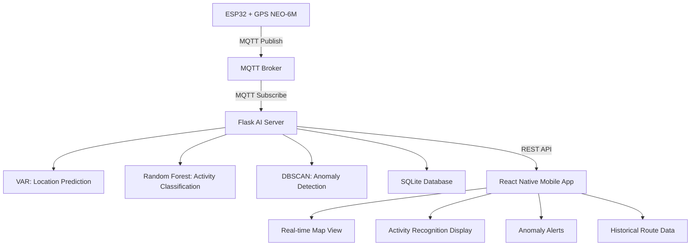

# 🛰️ Smart GPS Tracker with Edge-Based AI

**Smart GPS Tracker with Edge-Based AI for Activity Recognition and Route Anomaly Detection**

<div align="center">


*Sistem pelacakan GPS cerdas dengan prediksi lokasi, deteksi aktivitas, dan anomali rute berbasis AI*

**📚 Tugas Besar Mata Kuliah Kecerdasan Buatan - Semester 4**

</div>

---

## 🎯 **Tujuan Proyek**

> **📖 Tentang Proyek Ini**  
> Proyek ini merupakan **Tugas Besar** dari mata kuliah **Kecerdasan Buatan** pada Semester 4. Proyek ini dirancang untuk mengimplementasikan konsep-konsep AI/ML dalam aplikasi real-world GPS tracking dengan edge computing.

Membangun sistem pelacakan GPS berbasis AI yang:

- 📍 **Real-time GPS Tracking** - Pelacakan posisi real-time dengan visualisasi peta
- 🧠 **AI-Powered Predictions** - Prediksi lokasi menggunakan VAR (Vector Autoregression)
- 🏃 **Activity Recognition** - Klasifikasi aktivitas (walking, cycling, motor, car, stationary) dengan Random Forest
- 🚨 **Route Anomaly Detection** - Deteksi penyimpangan rute menggunakan DBSCAN clustering
- 📱 **Mobile Application** - Interface React Native untuk monitoring real-time
- 📊 **Historical Data** - Penyimpanan dan visualisasi histori perjalanan dengan SQLite

## 🧩 **Komponen Sistem**

### � **Hardware Components**

| Komponen | Fungsi | Status |
|----------|--------|--------|
| **ESP32** | Mikrokontroler untuk pembacaan GPS dan transmisi MQTT | ✅ Ready |
| **GPS NEO-6M** | Sensor GPS untuk mendapatkan koordinat (lat, lon, altitude) | ✅ Ready |
| **MQTT Broker** | Message broker untuk komunikasi real-time ESP32 → Flask | ✅ Ready |

### �🛠️ **Software Stack**

| Kategori | Teknologi | Fungsi |
|----------|-----------|--------|
| **Hardware Interface** | ESP32 + GPS NEO-6M | Sensor GPS dan data acquisition |
| **Communication** | MQTT (Mosquitto/Paho) | Real-time data streaming dari hardware |
| **AI/ML Backend** | Python Flask | Server AI untuk prediksi & klasifikasi |
| **Machine Learning** | Scikit-learn, Statsmodels | VAR, Random Forest, DBSCAN |
| **Mobile Frontend** | React Native + Expo + TypeScript | Aplikasi mobile cross-platform |
| **Database** | SQLite | Penyimpanan GPS data dan histori |
| **Maps** | React Native Maps | Visualisasi peta dan tracking |

### 🤖 **AI/ML Models**

| Model | Algoritma | Fungsi | File |
|-------|-----------|--------|------|
| **Location Predictor** | VAR (Vector Autoregression) | Prediksi koordinat GPS berikutnya | `var_model.py` |
| **Activity Classifier** | Random Forest | Klasifikasi aktivitas berdasarkan GPS | `random_forest_model_simple.py` |
| **Anomaly Detector** | DBSCAN Clustering | Deteksi anomali rute/pergerakan | `dbscan_anomaly_model_simple.py` |

---

## 🏗️ **Arsitektur Sistem**



**Data Flow:**
```
[ESP32 + GPS NEO-6M] → [MQTT] → [Flask AI Server] → [Mobile App] → [User Interface]
```

---

## 🧠 **Machine Learning Models**

### 📊 **AI Implementation Details**

| Model | Algoritma | Input | Output | Status |
|-------|-----------|-------|--------|--------|
| **Location Prediction** | VAR (Vector Autoregression) | Koordinat GPS time series | Prediksi posisi berikutnya | ✅ Implemented |
| **Activity Recognition** | Random Forest Classifier | GPS data (speed, acceleration) | Jenis aktivitas (walking/cycling/motor/car/stationary) | ✅ Implemented |
| **Route Anomaly Detection** | DBSCAN + Distance Analysis | Koordinat GPS, rute historis | Boolean anomali + confidence score | ✅ Implemented |

### 🎯 **Smart Features**

- **🔮 Predictive Tracking**: Prediksi lokasi 5-10 menit ke depan menggunakan VAR
- **🚶 Smart Activity Detection**: Otomatis mengenali moda transportasi dengan Random Forest
- **🚨 Intelligent Alerts**: Notifikasi cerdas saat terdeteksi anomali rute
- **📈 Route Learning**: Sistem belajar dari pola perjalanan pengguna
- **📍 Real-time Processing**: Edge computing untuk prediksi instant

---

## 📱 **Mobile Application Features**

### 🗺️ **Map & Visualization**
- **Real-time GPS Tracking** dengan Google Maps integration
- **Predicted Location Markers** (blue markers untuk prediksi VAR)
- **Historical Route Polylines** dengan color-coding berdasarkan aktivitas
- **Anomaly Alerts** (popup dan notifikasi real-time)
- **Activity Status Card** di bagian bawah dengan emoji indicators

### 📊 **Data Analytics**
- **Live Dashboard** dengan GPS metrics real-time
- **Route History** dengan filtering dan search capabilities
- **Activity Statistics** dan insights berdasarkan ML predictions
- **Anomaly Detection Reports** dengan confidence scores

### 🔔 **Notification System**
- **Real-time Anomaly Alerts** ketika DBSCAN mendeteksi pattern anomali
- **Activity Change Notifications** ketika Random Forest mendeteksi perubahan moda transportasi
- **Connection Status** monitoring untuk Flask backend
- **Battery Optimization** dengan smart refresh intervals

---

## 🚀 **Quick Start**

### **📋 Prerequisites**
- Node.js (v16+) dan npm
- Python (v3.8+) untuk AI backend
- Android/iOS device atau emulator
- VS Code atau IDE pilihan

### **� Installation**

**1. Clone Repository**
```bash
git clone https://github.com/your-username/smart-gps-tracker.git
cd smart-gps-tracker
```

**2. Setup Mobile App**
```bash
# Install dependencies
npm install

# Start Expo development server
npx expo start

# Untuk Android
npx expo start --android

# Untuk iOS
npx expo start --ios
```

**3. Setup AI Backend**
```bash
# Navigate to Flask backend
cd flask_edge

# Create virtual environment (recommended)
python -m venv venv
venv\Scripts\activate  # Windows
# source venv/bin/activate  # macOS/Linux

# Install Python dependencies
pip install -r requirements.txt

# Run Flask server
python app.py
```

### **⚙️ Configuration**

**Backend Configuration** - Edit `flask_edge/app.py`:
```python
# Database configuration
DATABASE_PATH = 'gps_data.db'

# MQTT configuration (optional)
MQTT_BROKER = "192.168.18.15"
MQTT_PORT = 1883
```

**Mobile App Configuration** - Edit `utils/api.ts`:
```typescript
const api = axios.create({
  baseURL: 'http://192.168.18.41:5000', // Sesuaikan dengan IP Flask server
  timeout: 5000,
});
```

---

## 📁 **Project Structure**

```
smart-gps-tracker/
├── 📱 app/                          # React Native application
│   ├── (tabs)/                      # Tab navigation
│   │   ├── _layout.tsx              # Tab layout
│   │   └── explore.tsx              # Data exploration screen
│   ├── index.tsx                    # Main GPS tracking screen
│   ├── history.tsx                  # Route history screen
│   ├── history_new.tsx              # Alternative history screen
│   ├── stats.tsx                    # Statistics screen
│   └── _layout.tsx                  # Root application layout
├── 🧩 components/                   # Reusable React components
│   ├── ActivityCard.tsx             # Activity status display
│   ├── AnomalyPopup.tsx             # Anomaly alert modal
│   ├── HistoryMap.tsx               # Historical route map
│   ├── HistoryPolyline.tsx          # GPS route visualization
│   ├── PredictionMarker.tsx         # Predicted location marker
│   ├── Legend.tsx                   # Map legend
│   └── ui/                          # UI components
├── 🎨 assets/                       # Static assets
│   ├── images/                      # App icons and images
│   └── fonts/                       # Custom fonts
├── 🔧 utils/                        # Utilities
│   ├── api.ts                       # API calls configuration
│   ├── types.ts                     # TypeScript definitions
│   └── db_helpers.py                # Database utilities
├── 🤖 flask_edge/                   # AI/ML Backend
│   ├── app.py                       # Main Flask application
│   ├── mqtt_client.py               # MQTT data handler
│   ├── models/                      # AI/ML models
│   │   ├── var_model.py             # VAR prediction model
│   │   ├── random_forest_model_simple.py    # Activity classifier
│   │   └── dbscan_anomaly_model_simple.py   # Anomaly detector
│   ├── requirements.txt             # Python dependencies
│   ├── gps_data.db                  # SQLite database
│   └── activity_model.pkl           # Trained ML model
├── 🎯 constants/                    # App constants
│   └── Colors.ts                    # Color definitions
├── 🪝 hooks/                        # Custom React hooks
└── 📋 scripts/                      # Build scripts
```

---

## 🔌 **API Endpoints**

### **Flask Backend (Port 5000)**

| Endpoint | Method | Description | Response |
|----------|--------|-------------|----------|
| `/` | GET | Health check | Status message |
| `/predict` | POST | Get AI predictions | Location, activity, anomaly |
| `/history` | GET | Fetch GPS history | Array of GPS data |
| `/history?limit=N` | GET | Fetch latest N records | Limited GPS data |
| `/test` | GET | Test connection | Test response |

### **Example API Usage**

```javascript
// Fetch prediction
const response = await fetch('http://192.168.18.41:5000/predict', {
  method: 'POST',
  headers: { 'Content-Type': 'application/json' },
  body: JSON.stringify({
    lat: -7.005,
    lon: 110.438,
    speed: 25,
    timestamp: Date.now()
  })
});

// Get history
const history = await fetch('http://192.168.18.41:5000/history?limit=50');
```

---

## 🛡️ **Data Types & Interfaces**

```typescript
// Mobile App Types
interface GPSData {
  lat: number;        // Latitude coordinate
  lon: number;        // Longitude coordinate  
  speed: number;      // Speed in km/h
  timestamp: number;  // Unix timestamp
}

interface PredictionResponse {
  activity: string;           // Detected activity (walking, cycling, motor, car, stationary)
  predicted_location: {       // VAR model prediction
    lat: number;
    lon: number;
  };
  is_anomaly: boolean;       // DBSCAN anomaly detection result
}

// Backend Database Schema
interface GPSRecord {
  id: number;
  lat: number;
  lon: number;
  speed: number;
  timestamp: number;
  activity: string;
  is_anomaly: boolean;
  created_at: string;
}
```

---

## 🧠 **AI/ML Model Implementation**

### **1. VAR (Vector Autoregression) - Location Prediction**
- **File**: `flask_edge/models/var_model.py`
- **Purpose**: Prediksi koordinat GPS berikutnya berdasarkan time series data
- **Input**: Sequence dari 10 GPS coordinates terakhir (lat, lon)
- **Output**: Predicted (lat, lon) untuk next location
- **Library**: `statsmodels.tsa.vector_ar.var_model`

### **2. Random Forest - Activity Classification** 
- **File**: `flask_edge/models/random_forest_model_simple.py`
- **Purpose**: Klasifikasi aktivitas berdasarkan pola pergerakan GPS
- **Features**: Speed, coordinate changes, time intervals, distance patterns
- **Classes**: Walking, Cycling, Motor, Car, Stationary
- **Library**: `sklearn.ensemble.RandomForestClassifier`

### **3. DBSCAN - Anomaly Detection**
- **File**: `flask_edge/models/dbscan_anomaly_model_simple.py`
- **Purpose**: Deteksi penyimpangan rute atau pergerakan tidak normal
- **Input**: GPS coordinates dalam time window tertentu
- **Output**: Boolean (normal/anomaly) dengan confidence score
- **Method**: Distance-based clustering analysis

---

## 📊 **Features Implementation**

### **📱 Mobile App Features**
- ✅ **Real-time GPS Tracking** - Google Maps dengan live marker updates
- ✅ **Activity Recognition Display** - Live status card dengan emoji indicators
- ✅ **Predicted Location Visualization** - Blue markers untuk VAR predictions
- ✅ **Route History** - Historical polylines dengan activity color-coding
- ✅ **Anomaly Alerts** - Real-time popup notifications untuk DBSCAN detections
- ✅ **Statistics Dashboard** - Analytics berdasarkan ML model outputs
- ✅ **Data Persistence** - Automatic saving ke SQLite database

### **🤖 Backend AI Features**
- ✅ **VAR-based Location Prediction** - Time series forecasting
- ✅ **Random Forest Activity Classification** - Multi-class prediction
- ✅ **DBSCAN Anomaly Detection** - Unsupervised outlier detection
- ✅ **SQLite Data Management** - Structured data storage
- ✅ **RESTful API Design** - JSON response format
- ✅ **Real-time Processing** - Low-latency prediction pipeline
- ✅ **MQTT Integration Support** - Ready for hardware integration

---

## 🔄 **Development Workflow**

### 🧪 **Testing & Debugging**
```bash
# Mobile app testing
npx expo start --clear

# Backend testing
cd flask_edge
python app.py

# API testing
# Use api-test.http file or Postman
```

### 🏗️ **Building**
```bash
# Build mobile app for production
npx expo build:android
npx expo build:ios

# Package backend
pip freeze > requirements.txt
```

---

## 🐛 **Common Issues & Solutions**

### **Mobile App Issues**
- **TypeScript errors**: Run `npx expo install --fix`
- **Metro bundler issues**: Clear cache with `npx expo start --clear`
- **Map not loading**: Check Google Maps API configuration

### **Backend Issues**
- **Model loading errors**: Ensure `.pkl` files are in correct directory
- **Database connection**: Check SQLite file permissions
- **API errors**: Verify Flask server is running on correct port

---

## 🔮 **Future Enhancements**

- [ ] **Real-time MQTT integration** with ESP32 hardware
- [ ] **Deep Learning models** (LSTM, CNN) for better prediction
- [ ] **Geofencing** features for location-based alerts
- [ ] **Multi-user support** with user authentication
- [ ] **Cloud deployment** (AWS, Google Cloud)
- [ ] **Advanced analytics** dashboard
- [ ] **Battery optimization** for mobile app

---

## 🤝 **Contributing**

1. **Fork** the repository
2. **Create** feature branch (`git checkout -b feature/AmazingFeature`)
3. **Commit** changes (`git commit -m 'Add AmazingFeature'`)
4. **Push** to branch (`git push origin feature/AmazingFeature`)
5. **Open** Pull Request

---

## 📜 **License**

Distributed under the MIT License. See `LICENSE` for more information.

---

## 👥 **Academic Information**

**📚 Course Details:**
- **Mata Kuliah**: Kecerdasan Buatan (Artificial Intelligence)
- **Semester**: 4
- **Jenis**: Tugas Besar
- **Tahun Akademik**: 2024/2025

**🎯 Learning Outcomes:**
- ✅ Implementasi algoritma Machine Learning (VAR, Random Forest, DBSCAN)
- ✅ Real-time data processing dan prediction
- ✅ Mobile application development dengan AI integration
- ✅ End-to-end system design dan deployment
- ✅ Database design dan API development

---   

<div align="center">

**⭐ Star this repo if you find it helpful!**

**📚 Tugas Besar - Mata Kuliah Kecerdasan Buatan**

**Made with ❤️ and 🧠 AI - Semester 4**

</div>
